# Fundamentos Teóricos del Neurobranding y UX

Este documento recopila las bases científicas, psicológicas y metodológicas que sustentan el playbook de creación de marca. Integrar estos principios asegura que las decisiones estratégicas y estéticas estén fundamentadas en el funcionamiento del cerebro humano, la usabilidad digital y los modelos de interacción social contemporáneos.

---

## 1. Neurocomunicación y Toma de Decisiones

El comportamiento del consumidor está fuertemente moldeado por procesos neurobiológicos preconscientes. La neurociencia moderna ha desmantelado el dualismo cartesiano que separaba la razón de la emoción, demostrando que esta última es la verdadera brújula de las decisiones humanas.

### La Hipótesis del Marcador Somático (Antonio Damasio)
*   **Fundamento:** Postulada por el neurólogo Antonio Damasio en 1994 (*El error de Descartes*), la hipótesis sostiene que la toma de decisiones no es un proceso algorítmico o frío de pros y contras. Por el contrario, depende de **señales emocionales y corporales previas** (marcadores somáticos) como cambios en la frecuencia cardíaca, respiración o conductancia de la piel.
*   **Funcionamiento:** Ante estímulos del mercado (ej. un pasillo repleto de marcas), el cerebro dispara estos marcadores de forma inconsciente. Si una marca está asociada a una experiencia pasada agradable o a un fuerte capital simbólico, el marcador somático actúa como una señal de atracción preconsciente. Si evoca tensión o disonancia, actúa como una alarma de rechazo instantáneo.
*   **Estructuras Implicadas:** 
    *   **La amígdala:** Procesa las emociones de forma hiperveloz, instintiva e inconsciente (Sistema 1).
    *   **Corteza prefrontal ventromedial (CPFvm):** Integra las señales viscerales de la amígdala con el pensamiento racional y reflexivo (Sistema 2) para calibrar el riesgo.
    *   **Evidencia Clínica:** Pacientes con daños en la CPFvm mantienen intactas sus capacidades lógicas, pero al perder el acceso a sus marcadores somáticos se vuelven **incapaces de tomar decisiones cotidianas y triviales**, ya que no tienen el "sentir" visceral que inclina la balanza.

### Sistema 1 y Sistema 2 (Daniel Kahneman)
*   **Sistema 1 (Automático, Rápido y Frugal):** Opera de manera subconsciente y sin esfuerzo. Consume muy poca energía metabólica y es el origen del 95% de las decisiones de compra diarias. Es sensible a metáforas, colores primarios, siluetas simples (formas geométricas básicas) y rostros.
*   **Sistema 2 (Lento, Deliberativo y Analítico):** Se activa bajo esfuerzo voluntario y genera fatiga mental rápidamente. 
*   **Regla de Oro en Branding:** El branding debe seducir y conectar con el **Sistema 1** para generar fluidez cognitiva y preferencia inmediata, proporcionando al **Sistema 2** solo los datos lógicos necesarios para racionalizar y justificar la decisión post-compra.

### Mecánica Atencional Visual
*   El sistema visual procesa imágenes **60,000 veces más rápido** que el texto.
*   La mirada se dirige de forma innata y refleja hacia rostros (y la dirección de su mirada), contrastes de color intensos y formas simples. El cerebro del comprador escanea las interfaces en saltos balísticos rápidos (movimientos sacádicos) intercalados con breves fijaciones visuales de milisegundos.

---

## 2. Reducción de Carga Cognitiva y Heurística

La **carga cognitiva** es el volumen de esfuerzo mental requerido por la memoria de trabajo. Minimizarla es indispensable para generar familiaridad y retención a largo plazo.

### Fluidez Cognitiva (Cognitive Fluency)
*   Es la facilidad con la que el cerebro humano procesa la información. Las cosas fáciles de pronunciar, leer y comprender son percibidas inconscientemente por el Sistema 1 como **más seguras, veraces y de alta calidad**.
*   Nombres comerciales complejos, identidades visuales saturadas de detalles o propuestas de valor abstractas elevan la fricción y activan el rechazo inmediato del consumidor.

### Sobrecarga de Opciones (Choice Overload)
*   **El Estudio de las Mermeladas (Universidad de Columbia):** Evidenció que exhibir 24 sabores atrae la atención de los clientes, pero genera parálisis y reduce drásticamente las ventas de cierre. Reducir la muestra a solo 6 sabores elimina la carga cognitiva de comparar variables complejas, disparando las compras exitosas.
*   **Aplicación:** El método de branding debe priorizar la curaduría agresiva: una propuesta de valor nuclear, un color dominante y un mensaje claro por punto de contacto.

---

## 3. Modelos Contemporáneos de Gestión de Marca

Las marcas modernas ya no son meros logotipos o identificadores utilitarios; constituyen redes asociativas, ecosistemas relacionales y representaciones de identidad cultural.

```mermaid
graph TD
    subgraph Keller [Modelo CBBE]
        R[Resonancia] --> J[Juicios/Sentimientos]
        J --> S[Significado]
        S --> P[Prominencia]
    end
    subgraph Vargo [S-D Logic]
        Co[Cocreación] --> Vu[Valor en Uso]
        Ro[Recurso Operante] --> Co
    end
    subgraph Holt [Branding Cultural]
        My[Mito de Identidad] --> Rs[Resolución de Ansiedad]
    end
    subgraph Gobe [Branding Emocional]
        Rel[Relación humana] --> Cx[Conexión Emocional]
    end
```



### A. Valor de Marca Basado en el Consumidor (CBBE) - Kevin Lane Keller
El verdadero valor de una marca no reside en los activos físicos o balances financieros, sino en la mente del consumidor. Se define como el efecto diferencial que el *conocimiento de la marca* provoca en la respuesta al marketing de la misma. Se construye mediante una pirámide secuencial:
1.  **Prominencia:** Construir conciencia de marca (*brand awareness*).
2.  **Significado:** Cimentar asociaciones fuertes, favorables y únicas.
3.  **Respuestas:** Provocar juicios de calidad y sentimientos de agrado.
4.  **Resonancia:** Alcanzar lealtad conductual profunda y sentido de comunidad activa.

### B. Lógica Dominante de Servicio (S-D Logic) - Vargo y Lusch
*   **El Cambio Epistémico:** Transiciona del intercambio de bienes físicos (donde la marca es un recurso estático o pasivo: *operand resource*) al intercambio de competencias e intangibles.
*   **Valor en Uso:** El valor de una marca nunca está incrustado en el producto en la estantería, sino que se cocrea contextualmente a través del uso (*value-in-use*). El consumidor es un **recurso operante** (*operant resource*): un agente activo que aporta sus conocimientos y competencias para coproducir la marca en tiempo real en una "dialéctica de control" compartida.

### C. Señalización de Identidad (Identity Signaling) - Jonah Berger
*   **Marca como Lenguaje:** Los consumidores tienen múltiples identidades y consumen marcas congruentes con su autoconcepto. Las marcas actúan como distintivos (*badges*) semánticos para comunicar afiliación grupal, estatus y valores.
*   **Divergencia y Contaminación:** Si una marca identitaria es adoptada de forma masiva por un grupo disímil (*out-group*), el significado original se contamina y pierde utilidad, forzando a los usuarios iniciales a abandonar la marca para evitar clasificaciones erróneas.
*   **Metas Duales:** La psique del consumidor busca la **asimilación** (conformarse al núcleo identitario de su grupo) pero a la vez la **diferenciación** (detalles periféricos únicos para mantener la individualidad).

### D. Comunidades de Marca - Muniz y O'Guinn
Un tejido especializado de relaciones sociales no limitadas por la geografía, unidas por la lealtad a una marca. Debe presentar tres marcadores:
1.  **Conciencia de Clase:** La conexión afectiva intrínseca entre los miembros (el "nosotros" de iniciados frente al "ellos" de competidores).
2.  **Rituales y Tradiciones:** Comportamientos repetitivos y cargados de simbolismo (saludos, unboxing rituales, narración mitificada del origen).
3.  **Responsabilidad Moral:** Obligación interiorizada de ayudar a otros miembros, retener a usuarios dudosos y guiar a los neófitos.

### E. Branding Cultural - Douglas Holt
Las marcas alcanzan estatus de iconos socioculturales (como Apple, Harley-Davidson o Nike) no por sus características técnicas o emocionales genéricas, sino por su destreza de actuar como **contenedores de Mitos de Identidad**. Las marcas icónicas identifican una **ansiedad o contradicción cultural aguda** en la sociedad en un momento histórico, y diseñan mitos publicitarios y estéticos que actúan como bálsamo o resolución imaginaria de dicha tensión.

### F. Branding Emocional (Marc Gobé) y los 10 Mandamientos
Reorienta el marketing transaccional hacia una conexión humanizada. Sus 10 pilares de transformación son:
1.  *De Consumidores a Personas* (dignificar el comportamiento).
2.  *Del Producto a la Experiencia* (crear memorias emotivas).
3.  *De la Honestidad a la Confianza* (intimidad comercial activa).
4.  *De la Calidad a la Preferencia* (elección afectiva).
5.  *De la Notoriedad a la Aspiración* (representar un ideal).
6.  *De la Identidad a la Personalidad* (inyectar carisma y carácter).
7.  *De la Función al Sentir* (diseño fenomenológico).
8.  *De la Ubicuidad a la Presencia* (crear atmósfera de marca).
9.  *De la Comunicación al Diálogo* (vulnerabilidad y escucha activa).
10. *Del Servicio a la Relación* (reconocimiento del otro).

### G. Branding Sensorial - Martin Lindstrom
*   **Sinergia Intermodal:** El impacto mnemotécnico es proporcional a la cantidad de canales sensoriales estimulados simultáneamente. El éxito depende de la **congruencia semántica** entre los estímulos, lo que puede triplicar la intención de compra.
*   **Háptica:** El peso y forma ergonómica de los empaques (como las curvas de la botella de vidrio de Coca-Cola) determinan la familiaridad táctil primaria y alteran la percepción del gusto.
*   **Olfato:** El canal olfativo **carece de filtros conscientes en el tálamo**, procesándose directamente en el sistema límbico. Su poder de rememoración y nostalgia es hasta **10,000 veces superior** al del gusto.

---

## 4. Leyes de UX Aplicadas al Diseño de Marca

La interfaz digital de la marca debe estructurarse bajo principios de usabilidad para acelerar la interacción:

| Ley de UX | Concepto Clave | Aplicación en Branding |
| :--- | :--- | :--- |
| **Ley de Hick** | El tiempo para decidir aumenta con el número y complejidad de opciones. | Limitar opciones de menú, curar catálogos y priorizar una única llamada a la acción (CTA) principal. |
| **Ley de Jakob** | Los usuarios prefieren que tu sitio funcione igual a los que ya conocen. | Utilizar patrones de interacción comunes. La innovación de marca debe ser estética y de contenido, nunca en la usabilidad fundamental. |
| **Ley de Prägnanz** | El cerebro organiza imágenes complejas en las formas más simples posibles. | Diseñar logotipos minimalistas, basados en contornos cerrados y figuras geométricas básicas para facilitar su recuerdo. |
| **Ley de Fitts** | El tiempo para alcanzar un objetivo depende del tamaño y distancia del objetivo. | Botones de conversión (CTA) de gran tamaño, posicionados en áreas de fácil alcance táctil o visual y con colores de alto contraste. |

---

## 5. El Arsenal Tecnológico y Biométrico: Protocolos y Métricas de Precisión

Para erradicar los sesgos de deseabilidad social y las mentiras conscientes del consumidor en la investigación declarativa tradicional, el neurobranding moderno despliega un instrumental de grado clínico.

### A. Electroencefalograma (EEG) Avanzado
*   **Protocolo de Captura:** Los estudios se realizan en entornos controlados y aislados de ruido ambiental. Se inicia con una calibración de línea base en reposo (resting baseline) de **10 segundos**, seguida de la exposición aleatoria a estímulos visuales (empaques, logos o interfaces) durante intervalos de **5 a 7 segundos** para anular sesgos de aprendizaje, finalizando con breves periodos de buffer.
*   **Localización y Sensores:** Mientras que los sistemas multicanal médicos mapean toda la corteza, las diademas comerciales de bajo coste (ej: Emotiv o Neurosky) se centran en la corteza prefrontal, posicionando el sensor principal en el **punto Fp1 (Fronte-polar 1)**, región crítica para la toma de decisiones perceptivas y juicios de valor.
*   **Procesamiento de Señal (Pipeline de Limpieza):** Para aislar las microfluctuaciones de potencial eléctrico del ruido muscular, parpadeo o interferencia de red, la señal cruda se somete a:
    1.  Eliminación de la deriva de corriente continua (DC offset).
    2.  Filtro pasabanda IIR (Infinite Impulse Response) de **0.5 a 50 Hz**.
    3.  Filtro Notch de **50 Hz** para eliminar el ruido eléctrico de la red de corriente alterna.
    4.  Denoising (remoción de ruido) avanzado por transformada wavelet de **6 niveles de descomposición** utilizando wavelets de Daubechies (**Daubechies "db7"** o **"db4"**).
*   **Derived Neuro-KPIs (Métricas de Referencia):**
    *   **Beta Waves (13–30 Hz):** Indican atención focalizada y procesamiento cognitivo activo.
    *   **Alpha Waves (8–12 Hz):** Relacionados con la relajación. Su supresión (reducción de potencia) denota atención activa.
    *   **Theta Waves (4–7 Hz):** Asociadas con procesamiento emocional. La potencia theta frontal izquierda mide la aproximación (agrado), y la derecha mide la evitación (rechazo).
    *   **Valence (Afecto):** Escala de agrado de 1 a 10. **Benchmark óptimo: > 5.0**.
    *   **Cognitive Load (Carga Cognitiva):** Escala de fatiga o dificultad mental. **Benchmark óptimo: < 5.0** (fluidez de procesamiento).
    *   **Detrended Fluctuation Analysis (DFA):** La presencia de altos valores DFA en ondas alfa combinado con bajos valores DFA en ondas beta predice estadísticamente las preferencias reales de compra.
    *   **Parámetros de Hjorth:** Medición de complejidad y movilidad estadística de la señal para predecir consistencia de la atención.

### B. Seguimiento Ocular (Eye Tracking) y Métricas POS
Monitorea la dinámica ocular en tiempo real frente a las Áreas de Interés (AOIs) del empaque o diseño (ej: logo, copy, packshot).
*   **TTFF (Time to First Fixation):** Tiempo en segundos que transcurre antes de que el usuario mire por primera vez un AOI. Mide el impacto y la saliencia visual. **Benchmark óptimo en POS para packshots: < 0.5 segundos**.
*   **TFD (Total Fixation Duration) / Dwell Time:** Tiempo acumulado de fijación en un AOI. Mide el engagement. **Benchmark óptimo para eslóganes: > 1.0 segundo**.
*   **EC (Eyeball Count):** Porcentaje de la muestra de usuarios que miró efectivamente el AOI.
*   **Gaze Paths & Heatmaps:** Rutas visuales que muestran la secuencia atencional del consumidor.

### C. Respuesta Galvánica de la Piel (GSR) y Arousal
*   **Funcionamiento:** Sensores colocados en el índice y medio de la mano no dominante miden las respuestas galvánicas de la piel (SCRs) generadas por la sudoración micro-glandular autónoma.
*   **Interpretación:** Registra la intensidad y número de picos de excitación emocional (**arousal**). Opera bajo el **Modelo de Mehrabian-Russell**, donde el estímulo ambiental (placer y arousal) dicta la respuesta somática de acercamiento o evitación de la marca.

---

### D. Sinergia Cross-Modal (Triangulación Multimodal)
Ningún sensor por sí solo provee un diagnóstico completo: el Eye-Tracking muestra dónde miran pero no qué sienten; el GSR mide la intensidad pero no la valencia; el EEG mide la valencia pero carece de resolución espacial visual. La **sinergia cross-modal** soluciona esto:

```
┌───────────────────────────────┐      ┌───────────────────────────────┐      ┌───────────────────────────────┐
│    EYE-TRACKING ("Dónde")     │      │        EEG ("Qué y Cómo")     │      │     GSR ("Cuánto/Arousal")    │
│ • Detecta TTFF y fija AOIs    │ ───> │ • Evalúa Valence (> 5.0)      │ ───> │ • Cuenta picos de excitación  │
│ • Evalúa TFD de eslóganes     │      │ • Evalúa Carga Cognitiva (<5) │      │ • Mide la intensidad somática │
└───────────────────────────────┘      └───────────────────────────────┘      └───────────────────────────────┘
                                                       │
                                                       ▼
                                ┌──────────────────────────────────────────────┐
                                │             SINERGIA CROSS-MODAL             │
                                │  Sincroniza y valida la Fluidez de Procesos  │
                                └──────────────────────────────────────────────┘
```

1.  **Sincronía Espacio-Cognitiva (Eye-Tracking + EEG):** Permite cruzar el mapa de calor con los niveles de carga cognitiva. Si el usuario mira el packshot rápidamente (TTFF < 0.5s) y la carga cognitiva se mantiene baja (< 5.0), se confirma la **fluidez de procesamiento** (el cerebro descodifica el empaque sin esfuerzo de búsqueda).
2.  **Integración Valence-Arousal (EEG + GSR):** Mide la respuesta somática completa. Un pico de GSR (arousal alto) debe correlacionarse con una asimetría frontal izquierda en EEG (valencia positiva) para confirmar entusiasmo. Si la valencia es negativa, indica estrés o culpa subconsciente.
3.  **Triangulación de Metáforas de Marca:** Integración de entrevistas cualitativas (ZMET) con monitorización biométrica en góndola (cámaras de expresiones faciales + GSR + eye-tracking portátil) para mapear el Customer Journey físico del consumidor en su entorno ecológico natural.

---

## 6. Marcas en la Era Agéntica: Brand Optimization for Agents (BOA) y GEO

En 2026, la visibilidad de la marca ya no depende de escalar posiciones de clics en buscadores tradicionales, sino de ser sintetizada y recomendada por agentes autónomos de Inteligencia Artificial (asistentes conversacionales y recomendadores de lenguaje natural).

### A. Canalización de Recomendación en LLMs
Los agentes autónomos procesan las marcas mediante un embudo de evaluación estructurado:
1.  **Query Formulation & Retrieval:** El agente desglosa la pregunta del usuario en sub-consultas y recupera información indexada de la web y de gráficos de conocimiento.
2.  **Site Parsing & Claim Extraction:** Visita las URLs más prometedoras y procesa el HTML. **Favorece masivamente los datos JSON-LD estructurados**, ya que se parsean en milisegundos, mientras que la copia de marketing tradicional es propensa a fallos de interpretación y tiempos de respuesta lentos.
3.  **Cross-Reference & Entity Verification:** Corrobora lo que la marca dice de sí misma con señales de terceros (redes, Wikidata, prensa, etc.).
4.  **Comparative Evaluation & Selection:** Compara, pondera las alternativas y presenta una recomendación cerrada (típicamente una sola opción o una lista corta de 3 candidatos).

### B. Señales de Posicionamiento Semántico
*   **Consensus-Driven Authority:** Los LLMs no inventan autoridad; la agregan. Se genera una cita de alta confianza cuando **múltiples fuentes independientes** (ej: Wikipedia, menciones de prensa, reseñas de foros) corroboran exactamente la misma afirmación sobre los atributos o el propósito de una marca.
*   **Menciones de Marca no Enlazadas (Unlinked Mentions):** A diferencia de Google que depende fuertemente de backlinks, los recomendadores de IA valoran las menciones de texto plano de la entidad en medios prestigiosos casi al mismo nivel que un enlace activo.
*   **La Trinidad Algorítmica:** El descubrimiento se basa en el funcionamiento conjunto de **Modelos de Lenguaje** (para síntesis y selección), **Gráficos de Conocimiento** (para verificar la identidad y relaciones de la entidad) y **Búsqueda Tradicional** (como base del índice de recuperación).

### C. Requerimientos Técnicos para BOA y GEO
1.  **Server-Side Rendering (SSR) Obligatorio:** Los bots de indexación de IA (ej. GPTBot, ClaudeBot, PerplexityBot) operan con estrictos timeouts de **1 a 5 segundos** y **no ejecutan código JavaScript del lado del cliente (CSR)**. Enviar un HTML vacío dependiente de JS condena a la marca a ser invisible para las IAs.
2.  **Apilamiento de Esquemas (Schema Stacking):** Implementar múltiples capas de JSON-LD interconectadas. La estructuración semántica robusta incrementa en **3.2 veces la probabilidad de ser citado** en respuestas sintetizadas (GEO), y enlazar la propiedad `sameAs` a Wikidata o Wikipedia incrementa las citas en un **450%**.
3.  **Arquitectura Push y WebMCP:**
    *   **Model Context Protocol (WebMCP):** Configurar y publicitar un servidor MCP en el HTML de la web mediante un tag `<link rel="model-context-protocol" href="/mcp">`. Los agentes de IA de última generación pueden conectarse directamente a este endpoint para consultar el catálogo o los datos estructurados en tiempo real sin necesidad de scrapear el HTML.
    *   **IndexNow:** Notificar en tiempo real las actualizaciones de la web para evitar el desfase de indexación de los modelos.

---

## 7. Ética de los Neuroderechos (Neurorights)

El avance en el escaneo biométrico y las interfaces cerebro-ordenador (BCI) ha forzado un nuevo marco regulatorio global de privacidad mental liderado por el neurobiólogo Rafael Yuste y el *Morningside Group*.

### La Jurisprudencia Histórica de Chile
*   **Reforma Constitucional:** Chile se convirtió en el primer país del mundo en modificar su constitución (Art. 19 N° 1) para consagrar explícitamente la actividad cerebral, los neurodatos y el libre albedrío cognitivo como derechos fundamentales inalienables.
*   **El Fallo Histórico *Girardi contra Emotiv Inc.* (2023):** La Corte Suprema de Chile ordenó a la empresa Emotiv Inc. cesar la recolección de ondas alfa y beta a través de su diadema comercial 'Insight' por carecer de consentimientos informados adecuados y de certificaciones sanitarias del Instituto de Salud Pública (ISP).
*   **Implicación en Branding:** Este fallo redefine el uso comercial de cualquier biometría o EEG, exigiéndoles cumplir con regulaciones de privacidad mental: consentimiento informado de grado clínico, anonimización irreversible en base de datos local y restricciones estrictas para evitar el secuestro y manipulación subconsciente del comportamiento.
